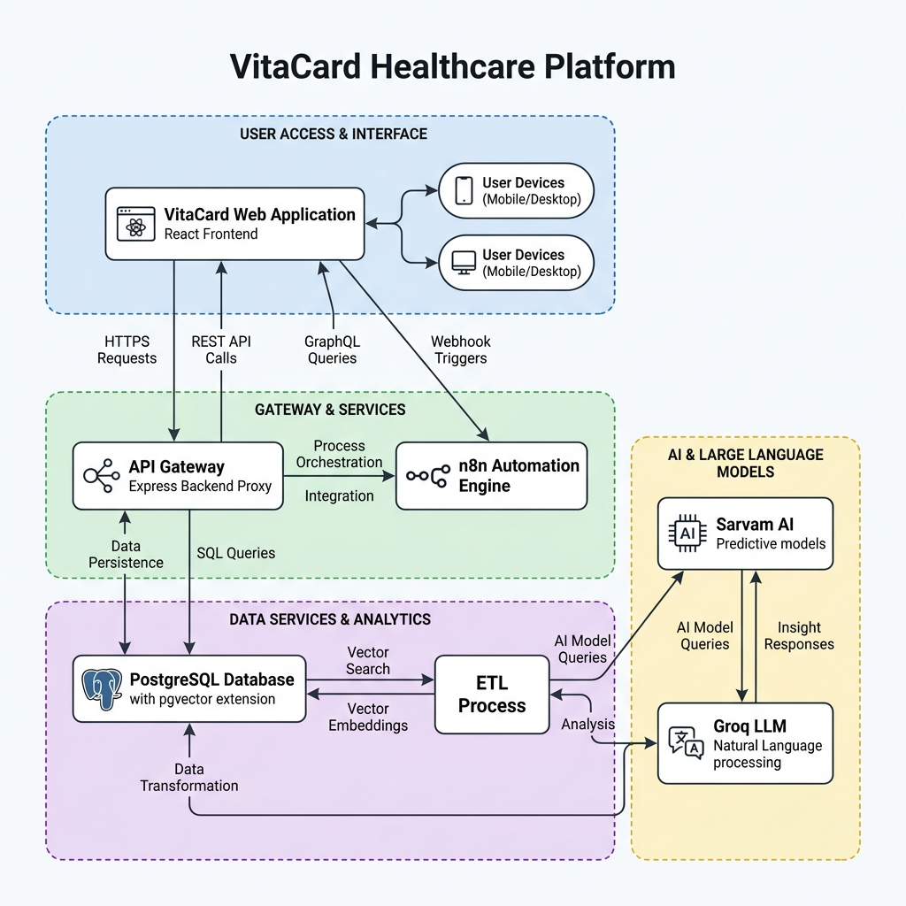

# VitaCard Healthcare Platform: Technical Blueprint & Architecture Documentation

**Author:** Satish Kumar  
**Version:** 1.0.0 (Production-ready)  
**Date:** June 22, 2026  
**Target Audience:** Engineering Leadership, Senior Architects, and Project Stakeholders  

---

## Executive Summary

The VitaCard Healthcare Platform is an automated, intelligent private healthcare membership portal. Operating on a subscription model starting at £9.99/month, it provides members with direct access to private medical practitioners, including GPs, dentists, therapists, and mental health specialists, along with up to 20% savings on consultations. 

The technical architecture is built on a modern decoupling of UI presentation, backend gateway proxying, database-native vector indexing, and low-code workflow automation. The platform features an AI-driven triage chatbot, Hindi/English speech synthesis and translation, client-side OCR report parsing, dual-role user dashboards, and transactional email notification flows.

---

## Table of Contents
1. [Introduction](#1-introduction)
2. [Project Objectives](#2-project-objectives)
3. [System Architecture](#3-system-architecture)
4. [Core Features](#4-core-features)
5. [System Workflow](#5-system-workflow)
6. [n8n Automation & RAG Matching](#6-n8n-automation--rag-matching)
7. [Security Considerations](#7-security-considerations)
8. [Deployment Architecture](#8-deployment-architecture)
9. [Limitations & Future Scope](#9-limitations--future-scope)
10. [Conclusion](#10-conclusion)

---

## 1. Introduction

Primary healthcare systems face global bottlenecks, characterized by prolonged wait times in public systems (such as the NHS) and significant search friction when patients attempt to find specialized private care. Additionally, the lack of digital tools leaves clinics dealing with high administrative overhead.

VitaCard addresses these challenges through a subscription-based private healthcare membership model. The platform is designed to:
1. **Reduce Triage Friction:** Replace traditional search bars with an empathetic, multi-turn AI chatbot that collects patient history (anamnesis) before matching.
2. **Lower Private GP Access Costs:** Implement a member-only discount framework integrated into scheduling portals.
3. **Automate Clinic Operations:** Seamlessly link booking events to clinician queues and trigger transactional notifications, minimizing manually managed check-ins.

---

## 2. Project Objectives

From an architectural and product perspective, the development of VitaCard is guided by the following objectives:
* **Vector-native Matchmaking:** Leverage high-dimensional semantic search over clinician bios (using cosine distance) instead of relying on fragile keyword matches.
* **Bilingual Accessibility:** Provide voice and text localization for English and Hindi speakers, utilizing neural TTS models to bridge literacy barriers.
* **Client-Side Offloading:** Execute OCR processing client-side in the browser, saving server resources and ensuring patient privacy.
* **stateless Deployment:** Standardize the platform into a single Docker image containing the web gateway, database, and workflow engines to enable rapid scaling.
* **Transactional Reliability:** Ensure atomic operations for bookings, automatically updating patient records and triggering email dispatchers via Resend APIs.

### 2.1 5-Week Implementation Roadmap (GSoC-Style)

The development of the VitaCard platform is structured into a fast-paced 5-week lifecycle with distinct deliverables for each phase:

* **Week 1: Core Triage and Data Engine Foundation**
  - **Focus:** Infrastructure and Database Setup.
  - **Deliverables:** PostgreSQL 15 database schema initialization, HNSW index configurations for `pgvector` operations, and custom JS script seeding. Setup n8n server configurations, webhook listeners, and SQLite persistence. Build chat session tracking tables (`chat_sessions`, `session_messages`).
* **Week 2: AI Dialog Engine & RAG Matching Pipeline**
  - **Focus:** Search Vectorization & Conversational Workflows.
  - **Deliverables:** Link Cohere 1024-dimensional English embeddings nodes inside the matching graph. Implement parameterized cosine distance query logic. Integrate Groq's Llama-3.3-70b Chat Completion nodes to run multi-turn clarifying anamnesis harvesting and final match reranking.
* **Week 3: Frontend UI & Scheduling Calendars**
  - **Focus:** Dashboards and Booking Operations.
  - **Deliverables:** Implement the responsive, glassmorphic React 19 UI. Build separate patient EHR cards and doctor appointment list dashboards. Build interactive booking, rescheduling, and cancellation handler utilities syncing with client-side triggers. Add custom Three.js WebGL backgrounds.
* **Week 4: Client-Side OCR & Server-Side Security**
  - **Focus:** Document Parsing & JWT Authorization.
  - **Deliverables:** Integrate `Tesseract.js` client-side parsing inside background worker threads. Write zero-dependency backend JWT utilities using Node's native `crypto` package. Implement `/api/auth/signup`, `/api/auth/login`, `/api/auth/me`, and `/api/auth/update-profile` endpoints with token bearer header verifications.
* **Week 5: Notifications, Containerization & Space Deploy**
  - **Focus:** Transactional Communications & Container Orchestration.
  - **Deliverables:** Expose Resend HTML transactional email notification APIs on Express (falling back to local transcripts logging). Build the final Dockerfile setting up Node and Postgres runtime environments. Write `start.sh` startup automation scripts. Deploy and verify on Hugging Face Spaces.

---

## 3. System Architecture

The VitaCard system is designed with three distinct architectural layers to isolate presentation, integration, and database operations.



### 3.1 Presentation Layer (Frontend)
Built using **React 19** and **Vite 8**, the frontend uses standard CSS for custom glassmorphism, responsive CSS grids, and interactive 3D WebGL canvasses (React Three Fiber/Three.js) to deliver a premium user experience.
* **Client-Side Storage:** User session parameters, dashboards, and booking lists are managed in `localStorage` to allow stateless execution in testing environments.
* **OCR Processor:** Uses `Tesseract.js` directly within the browser thread to parse uploaded image documents (PNG/JPG) without transmitting raw image data to external servers.

### 3.2 Gateway & Proxy Layer (Backend Server)
An **Express.js** web server serves as the entry point for container traffic, listening on port 7860.
* **Static File Serving:** Serves the compiled React assets (from `/frontend-assets`).
* **Reverse Proxy:** Proxies `/n8n/*`, `/webhook/*`, `/rest/*`, and `/static/*` requests to the internal n8n service, insulating administration routes.
* **Speech & Translation Gateway:** Exposes custom REST endpoints (`/api/audio-to-text` and `/webhook/doctor-chat`) to handle speech recognition (STT) and translation using **Sarvam AI** APIs.

### 3.3 Data & Intelligence Layer (n8n & PostgreSQL)
* **n8n Automation Engine:** An internal, headless instance of n8n orchestrates patient sessions, triggers database inserts/updates, calls external LLM models (Cohere, Groq), and formats responses.
* **PostgreSQL Database:** A PostgreSQL 15 instance equipped with the **pgvector** extension. It hosts clinician records, embeds high-dimensional vector representations of doctor bios, and handles cosine similarity searches.

### 3.4 Codebase Structure & File Purpose

Below is the directory mapping of the VitaCard project, summarizing the functional role of each critical source file:

```
medical-bot/
├── deploy/
│   ├── Dockerfile                   # Configures the Node.js/PostgreSQL container runtime
│   ├── start.sh                     # Orchestrates database creation, seeding, n8n webhook registration, and boots Express
│   ├── deploy-package.json          # Container-only production dependency manifest
│   ├── deploy-readme.md             # Readme instructions tailored for Hugging Face Space deployments
│   ├── init_schema.sql              # SQL script detailing the doctors, chat_sessions, and session_messages tables
│   ├── seed_doctors.js              # Node database seeder populating doctor records with vectors
│   └── doctor_rag_workflow.json     # Declarative n8n workflow configuration representing matching routes
├── scripts/                         # Contains localized system utility, verification, and testing shell scripts
│   ├── check_err.py                 # Error diagnostics helper
│   ├── seed_postgres.py             # Backup database populator
│   └── test-*.sh                    # Integrations scripts for webhooks, active sessions, and n8n responses
├── src/                             # Front-end codebase root
│   ├── db/
│   │   └── doctors.json             # Local database of doctors used in client search fallbacks
│   ├── utils/
│   │   └── state.js                 # LocalStorage synchronizer, state emitters, and JWT API controllers
│   ├── components/
│   │   ├── Navbar.jsx               # Header navigation panel managing notifications and sessions
│   │   ├── Hero.jsx                 # Site landing banner promoting memberships and registrations
│   │   ├── Services.jsx             # Informational cards outlining clinic fields
│   │   ├── DoctorsList.jsx          # Directory query list with booking modal triggers
│   │   ├── DoctorDetails.jsx        # Practitioner profiles presenting bio descriptions and available slots
│   │   ├── Chat.jsx                 # AI triage chatbot overlay handling dialog bubbles and quick replies
│   │   ├── Login.jsx                # Multi-role authentication entry page
│   │   ├── Signup.jsx               # Demographic fields input forms for patients and clinicians
│   │   └── Dashboard.jsx            # Multi-panel dashboards rendering patients EHR/reports and doctor calendars
│   ├── App.jsx                      # Main routing controller resolving hash addresses (#/login, #/dashboard)
│   ├── main.jsx                     # Core application mounting node
│   ├── index.css                    # Design system tokens and styling rules
│   └── dashboard.css                # Layout rules styling patient/practitioner dashboard screens
├── server.js                        # Express.js web server handling routing, proxying, and custom JWT auth
├── package.json                     # Main node workspace specifications and dependencies
├── vite.config.js                   # Packaging bundler parameters with API proxy setups
└── documentation.md                 # Deep technical blueprint and documentation
```

### 3.5 Dependencies and Library Matrix

The platform integrates third-party modules across frontend, backend, and workflow automation layers:

#### 3.5.1 Frontend (React Application)
* **`react` / `react-dom` (v19):** UI rendering framework.
* **`three` (v0.184.0) / `@react-three/fiber` (v9.6.1) / `@react-three/drei` (v10.7.7):** Renders the premium 3D glassmorphic WebGL particle effect in the background of the landing pages.
* **`tesseract.js` (v7.0.0):** Browser-side Optical Character Recognition (OCR) engine used to parse patient diagnostic reports inside background web workers without transmitting raw files to the backend.
* **`vite` (v8.0.12):** Packaging tool providing local proxy tunnels to the backend Express server during development.

#### 3.5.2 Backend Server & Container Gateway
* **`express` (v4.18.2):** Web application framework handling REST APIs, routing, and static file deliveries.
* **`http-proxy-middleware` (v2.0.6):** Transparently forwards internal client API webhook requests to the background n8n automation service running inside the Docker network interface.
* **`crypto` (Node.js Native):** Generates security signatures (`HS256`) and processes custom URL-safe base64 encodes/decodes to run a zero-dependency JWT system.
* **`fs` / `path` (Node.js Native):** Manages local persistence for registered accounts inside `users.json` during the container runtime.

#### 3.5.3 Automation & Database Layer
* **`n8n` (v1.0+):** Graphical workflow engine executing the triage graph, dialog memories, and LLM integrations.
* **`pg` / `pgvector` (PostgreSQL 15 extension):** Relational database storing vectors representing clinician credentials and bios, executing HNSW L2 distance queries.

### 3.6 Express API Endpoints Registry

The Express gateway exposes the following REST endpoints to drive user authentication, notification events, and communication scripts:

1. **`POST /api/auth/signup`**
   - **Purpose:** Registers new patient or doctor accounts.
   - **Behavior:** Validates inputs, checks for existing emails in `users.json`, initializes a unique ID (and `doctorId` parameter for doctors), signs a stateless JWT, writes records to disk, and returns the token with the password-scrubbed user object.
2. **`POST /api/auth/login`**
   - **Purpose:** Authenticates user credentials.
   - **Behavior:** Searches `users.json` for active role, email, and password matches. Upon verification, issues an HS256 JWT containing user session keys.
3. **`GET /api/auth/me`**
   - **Purpose:** Resolves active session parameters.
   - **Behavior:** Parses the token from the request `Authorization: Bearer <token>` header, decodes user parameters, and returns verified user fields.
4. **`POST /api/auth/update-profile`**
   - **Purpose:** Commits changes to patient clinical logs or practitioner information.
   - **Behavior:** Enforces JWT header validation, resolves the active user ID, merges submitted modifications with the account record in `users.json`, writes to disk, and returns updated profiles.
5. **`POST /api/send-appointment-email`**
   - **Purpose:** Triggers appointment email notifications for bookings, cancellations, or rescheduling.
   - **Behavior:** Reads clinical calendar details, action type (`book`, `cancel`, `reschedule`), old dates/times (for reschedule tracking), queries the Resend API, and dispatches dynamic HTML formatting to both patients and doctors. Falls back to a developer Resend API key (`re_65vpprKs_GJAgs2H2qLFsWqLGWQd4NVsL`) or local logging if no API keys are supplied.
6. **`POST /api/send-appointment-reminder`**
   - **Purpose:** Dispatches manual or automated email reminders for scheduled appointments.
   - **Behavior:** Accepts appointment data, determines consultation mode (offline vs. online), formats the HTML template (attaching the Jitsi Meet link if online), and dispatches it to both patient and doctor emails using Resend.
7. **`POST /api/audio-to-text`**
   - **Purpose:** Gateway route forwarding client voice bytes to Sarvam AI audio transcoders for transcription.
8. **`POST /webhook/doctor-chat`**
   - **Purpose:** Relays active patient text queries to internal n8n triage workflows on port 5678.
9. **`/n8n/*`, `/webhook/*`, `/rest/*`, `/static/*`**
   - **Purpose:** Proxies administration interfaces and active webhook endpoints directly to n8n, preventing port exposure.

---

## 4. Core Features

### 4.1 Multi-Turn Conversational Triage
The triage interface is designed with a responsive panel that scales to 75% of the viewport on desktop. The chatbot uses a Llama-3.3-70b model (via Groq) to collect symptom duration, severity, location preferences, and urgency before querying the database.

### 4.2 Client-side OCR Report Parser
Patients can upload a diagnostics report image. The frontend extracts text using Tesseract.js in a background worker, displays a scanning status animation, and passes the extracted report string directly to the chatbot session. This bypasses the clarification questions and initiates an immediate semantic doctor search.

### 4.3 Sarvam AI Voice & Translation Router
The gateway manages multi-language translation and voice synthesis:
1. **Language Detection:** Detects Hindi (Devanagari) inputs.
2. **Translation Gateway:** Translates Hindi text to English using Sarvam's formal `mayura:v1` model for vector database queries.
3. **Synthesis Engine:** Translates English chatbot replies back to Hindi, appending report summaries, and synthesizes speech using Sarvam's `bulbul:v3` voice model (`shubh` speaker), returning a playable base64 audio payload to the frontend.

### 4.4 Dual-Role Dashboards
* **Patient Panel:** Includes an interactive calendar, diagnostic reports tracker, active notifications, and a simulated NFC digital membership card.
* **Doctor Panel:** Tracks the patient booking queue, displays EHR records, allows writing consultation notes, and provides scheduling controls.

### 4.5 Resend Email Integration
When a booking is finalized, the system issues a POST call to the Express backend. If configured, the backend calls the Resend REST API to dispatch transactional HTML emails to the patient and the doctor. Otherwise, it logs a formatted email transcript locally to `sent_emails.txt`.

---

## 5. System Workflow

The step-by-step data execution sequence is structured as follows:

```
[Patient UI] 
     │  (1) Inputs symptom text or uploads lab report image
     ▼
[Express Server Proxy]
     │  (2) Sanitizes input; translates Hindi to English (Sarvam AI)
     ▼
[n8n Automation Webhook]
     │  (3) Checks database for active session
     ├───────> (New Session) ──> Create record in postgres (chat_sessions)
     └───────> (Existing)   ──> Load message logs (session_messages)
     │
     ▼
[Session Logic Node]
     ├───────> (Data Incomplete) ──> Call Groq (Llama-3.3-70b) -> Return clarifying Q
     └───────> (Data Complete)   ──> Call Cohere (embed-english-v3.0) -> Generate 1024-dim vector
                                              │
                                              ▼
                                     [PostgreSQL pgvector Query]
                                     Perform L2 distance calculation: 
                                     SELECT id, bio, embedding <=> :vector AS score
                                              │
                                              ▼
                                     [Reranker Node (Groq LLM)]
                                     Evaluates top 5 profiles -> Selects best clinician
                                              │
                                              ▼
                                     [Respond Node]
                                     Returns doctor details card & synthesized voice stream (Sarvam TTS)
```

---

## 6. n8n Automation & RAG Matching

The backend RAG (Retrieval-Augmented Generation) pipeline is built entirely inside the n8n integration engine. 

### 6.1 Database Schema
The database requires three tables to manage vector matching and session memory:
```sql
CREATE EXTENSION IF NOT EXISTS vector;

-- Clinicians table with vector indexing
CREATE TABLE doctors (
    id SERIAL PRIMARY KEY,
    name VARCHAR(100),
    specialization VARCHAR(100),
    experience_years INT,
    location VARCHAR(100),
    languages TEXT[],
    availability VARCHAR(100),
    rating NUMERIC(3,2),
    fee_range VARCHAR(50),
    bio TEXT,
    phone VARCHAR(50),
    email VARCHAR(100),
    hospital_name VARCHAR(150),
    profile_image_url TEXT,
    embedding vector(1024)
);

CREATE INDEX ON doctors USING hnsw (embedding vector_l2_ops);

-- Active chatbot triage sessions
CREATE TABLE chat_sessions (
    session_id VARCHAR(50) PRIMARY KEY,
    original_query TEXT,
    questions_asked JSONB DEFAULT '[]'::jsonb,
    answers_collected JSONB DEFAULT '[]'::jsonb,
    status VARCHAR(20) DEFAULT 'questioning',
    created_at TIMESTAMP DEFAULT NOW()
);

-- Message logs for session context
CREATE TABLE session_messages (
    id SERIAL PRIMARY KEY,
    session_id VARCHAR(50) REFERENCES chat_sessions(session_id),
    role VARCHAR(10) CHECK (role IN ('user', 'bot')),
    content TEXT,
    turn_number INT,
    created_at TIMESTAMP DEFAULT NOW()
);
```

### 6.2 Semantic Search Query
Inside the `pgvector Semantic Search` node, the vector representation generated by Cohere is compared against Doctor embeddings:
```sql
SELECT 
  d.id, d.name, d.specialization, d.experience_years, d.location, 
  d.languages, d.rating, d.fee_range, d.bio, d.hospital_name,
  1 - (d.embedding <=> '{{ $json.embeddingStr }}'::vector) AS similarity_score
FROM doctors d
WHERE d.embedding IS NOT NULL
ORDER BY d.embedding <=> '{{ $json.embeddingStr }}'::vector
LIMIT 5;
```

### 6.3 n8n Workflow Nodes & Purpose

The automated triage workflow defined in `doctor_rag_workflow.json` consists of the following 25 integrated execution nodes:

1. **`webhook` (HTTP Webhook):** Entry point. Listens for incoming `POST` messages forwarded from the Express gateway on `/webhook/doctor-chat`.
2. **`Parse Input` (JavaScript Code):** Extracts incoming variables, including the raw query string, active `session_id`, language context, and file upload state flags.
3. **`Is New Session?` (If Condition):** Evaluates if a matching `session_id` exists. Routes to database initialization if missing, else resumes diagnostic loops.
4. **`Create Session in DB` (PostgreSQL):** Inserts a new session record into the `chat_sessions` table for fresh users.
5. **`Load Existing Session` (PostgreSQL):** Queries the database to retrieve historical message parameters and state flags for returning sessions.
6. **`Merge Session Data` (JavaScript Code):** Normalizes and aggregates database variables and sets up n8n execution parameters.
7. **`Save User Message` (PostgreSQL):** Logs the patient's incoming chat message in the `session_messages` historical table.
8. **`Session Flow Logic` (JavaScript Code):** Evaluates dialogue progress, counts active conversational turns, tracks symptoms, and determines if the triage limit is met or if a semantic search is required.
9. **`Route: Search or Question?` (Switch Route):** Branches execution flow. Directs control to semantic search query lines, or forks to clarifying question generators.
10. **`Build Question Prompt` (JavaScript Code):** Aggregates the symptom profile, language context, and previous bot questions to construct the prompt payload for the generator.
11. **`Groq - Generate Question` (Groq API):** Calls Groq's Llama-3.3-70b Chat Completion model to synthesize a contextually logical, conversational triage question.
12. **`Extract Question Text` (JavaScript Code):** Parses the raw response text from the Groq API payload.
13. **`Save Question to DB` (PostgreSQL):** Logs the new bot question under `chat_sessions` memories and saves the dialogue string to the history database.
14. **`Format Question Response` (JavaScript Code):** Packages the question output with visual indicators, including progress card values and language badges.
15. **`Build Search Context` (JavaScript Code):** Aggregates all patient query turns and clinical statements into a single dense summary block, optimized for semantic embedding.
16. **`Update Status to Searching` (PostgreSQL):** Flags the session status as `searching` in the `chat_sessions` table.
17. **`Cohere - Generate Embedding` (Cohere API):** Dispatches the dense summary string to Cohere's `embed-english-v3.0` API, yielding a 1024-dimensional floating-point vector.
18. **`Extract Embedding Vector` (JavaScript Code):** Resolves the floating-point array from the Cohere response and serializes it for database lookup queries.
19. **`pgvector Semantic Search` (PostgreSQL):** Runs L2 distance similarity math (`<=>`) on the `doctors` database table using the 1024-dimensional query vector, returning the top 5 matches.
20. **`Process Search Results` (JavaScript Code):** Filters, cleans, and serializes the list of matching clinician records into a structured JSON string.
21. **`Groq - Rank & Select Doctor` (Groq API):** Prompts Llama-3.3-70b with the parsed diagnostics summary and candidate profiles, selecting the single best practitioner match and constructing clinical reasoning metrics.
22. **`Build Doctor Card` (JavaScript Code):** Packages the chosen clinician's details, likeness scores, location records, and AI reasoning parameters into a custom output card.
23. **`Save Result to DB` (PostgreSQL):** Stores the final selection payload, updates the session status as `completed`, and records the response to historical message tables.
24. **`Respond with Question` (HTTP Response):** Dispatches the clarifying question card directly back to the active user's webhook request stream.
25. **`Respond with Doctor Card` (HTTP Response):** Dispatches the finalized doctor card match details and AI reasoning back to the user's chat screen.

---

## 7. Security Considerations

* **Server-side JWT Authentication:** The platform enforces JSON Web Token (JWT) verification for patient and doctor dashboards. On successful authentication (`/api/auth/login` or `/api/auth/signup`), the server signs stateless tokens containing user IDs and roles using the HMAC SHA256 (`HS256`) algorithm and custom URL-safe base64 encoding. API routes like `/api/auth/me` and `/api/auth/update-profile` require verification via the `Authorization: Bearer <token>` header, restricting data modifications to the authenticated session owner.
* **Decoupled API Key Architecture:** The codebase uses `process.env` lookups. Secrets are injected at container startup and excluded from git via `.gitignore`.
* **SQL Injection Countermeasures:** All database queries within n8n workflows use parameterized variables (e.g., `'{{ $json.session_id }}'`), preventing SQL injection from user chat inputs.
* **CORS and Routing Insulation:** The Express proxy isolates ports. External traffic has access only to port 7860. The database port (5432) and the n8n editor port (5678) are restricted to the local network loopback (`127.0.0.1`).
* **Sandbox Data Isolation:** LocalStorage is utilized for patient histories and booking schedules. This ensures data is isolated to the client browser session.

---

## 8. Deployment Architecture

VitaCard is packaged into a single Docker container. This allows the frontend gateway, the n8n engine, and the PostgreSQL database to run as local microservices in a single isolated sandbox.

```
                  Public HTTP Traffic (Port 7860)
                               │
                               ▼
               ┌───────────────────────────────┐
               │    Express.js Proxy Server    │
               │   (Serves React / API Routes) │
               └──────┬─────────────────┬──────┘
                      │                 │
           Internal Reverse Proxy       │ Internal Loopback API Calls
           to /n8n (Port 5678)          ▼ (Port 5678/webhook)
               ┌──────┴──────┐   ┌──────────────┐
               │ n8n Engine  │──>│ PostgreSQL   │ (Port 5432)
               │ (Workflows) │   │ (pgvector)   │
               └─────────────┘   └──────────────┘
```

### 8.1 Dockerfile Configuration
The container uses `node:20-bookworm` to install node requirements, n8n globally, and the PostgreSQL 15 server alongside `postgresql-15-pgvector`.
```dockerfile
FROM node:20-bookworm
RUN apt-get update && apt-get install -y --no-install-recommends \
      gnupg2 curl ca-certificates sudo \
    && curl -fsSL https://www.postgresql.org/media/keys/ACCC4CF8.asc \
       | gpg --dearmor -o /usr/share/keyrings/pgdg.gpg \
    && echo "deb [signed-by=/usr/share/keyrings/pgdg.gpg] http://apt.postgresql.org/pub/repos/apt bookworm-pgdg main" \
       > /etc/apt/sources.list.d/pgdg.list \
    && apt-get update \
    && apt-get install -y --no-install-recommends \
      postgresql-15 postgresql-15-pgvector postgresql-client-15 \
    && rm -rf /var/lib/apt/lists/*
RUN npm install -g n8n
WORKDIR /app
COPY deploy/deploy-package.json ./package.json
RUN npm install --only=production
COPY . .
RUN chmod +x deploy/start.sh
USER 1000
EXPOSE 7860
CMD ["./deploy/start.sh"]
```

### 8.2 Startup Orchestration (`start.sh`)
When the container starts:
1. PostgreSQL is initialized in `/data/pgdata` and started.
2. The database `vitacard_db` is created, schema `init_schema.sql` is applied, and `seed_doctors.js` is executed.
3. n8n is started in the background. The script waits for it to boot and registers an admin owner account using REST calls.
4. Cohere and Groq credentials are added to the n8n database via API calls.
5. The `doctor_rag_workflow.json` workflow file is patched with the credentials IDs and imported via the n8n CLI.
6. The Express server is booted on port 7860 to handle routing and start serving static files.

---

## 9. Limitations & Future Scope

### 9.1 Container Recyclability & Persistence
Because Hugging Face Spaces are stateless, restarts rebuild the container image. This clears the local database state.
* **Future Scope:** Migrate the PostgreSQL container configuration to external managed database instances (e.g., Supabase or Neon DB) using SSL connections.

### 9.2 UI Localization, Voice Input, and Report Upload Controls
The Language selection dropdown, Speech-to-Text (Voice) input, and client-side OCR Image upload buttons are fully re-enabled and active in the triage chat UI. This allows users to perform bilingual verbal consultations (with default English text-to-speech starting in muted mode) and upload medical report images for on-demand OCR parsing.
* **Current Status:** Fully implemented. Future work involves refining continuous speech stream recognition and adding support for PDF report parsing on the client side.

### 9.3 Payment Gateway Integration
Bookings are currently logged without verification.
* **Future Scope:** Integrate Stripe or Razorpay APIs to handle monthly subscription models, manage membership tiers, and issue active NFC membership cards.

---

## 10. Conclusion

The VitaCard Healthcare Platform demonstrates a robust approach to modern digital healthcare triage. By utilizing a hybrid model of Express proxy routing, pgvector database-level similarity calculations, and n8n automation graphs, the platform shows how low-code workflows can be combined with custom AI features to create a secure, scalable, and responsive patient experience.
